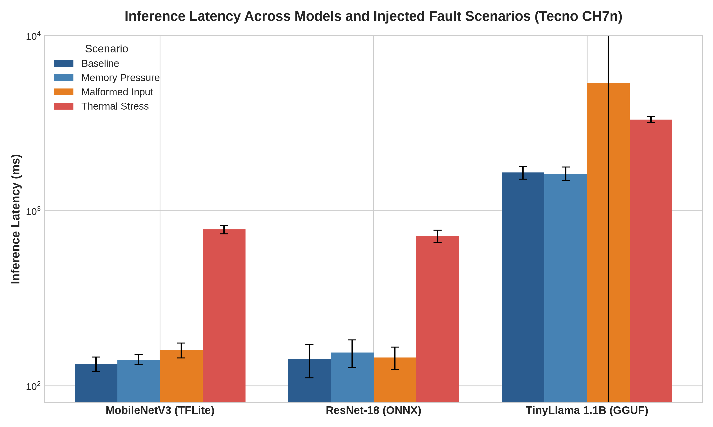
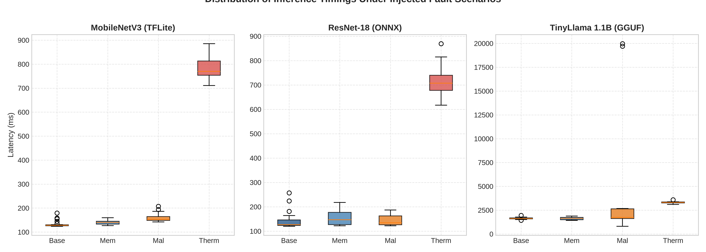
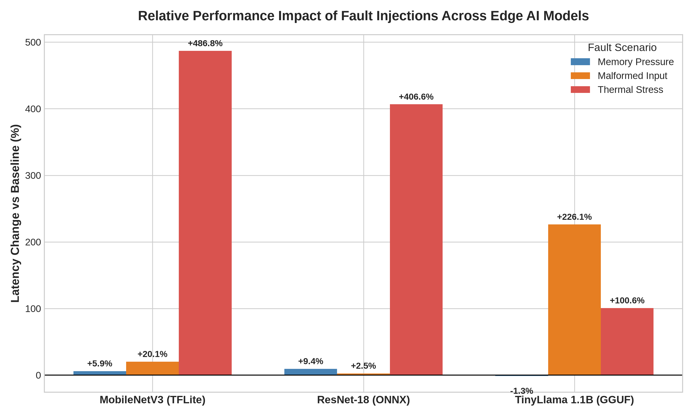
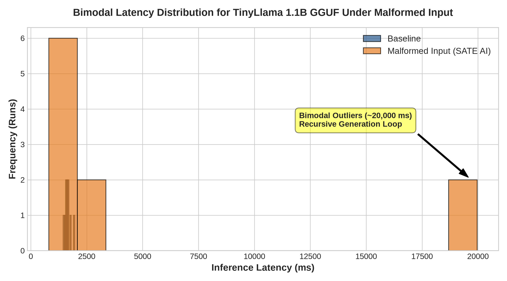

# Introduction

Quantized Large Language Models (LLMs) and compact computer vision architectures are increasingly deployed directly inside mobile applications. Runtimes such as TensorFlow Lite \[[3](#ref3)\], ONNX Runtime \[[4](#ref4)\], and llama.cpp \[[5](#ref5)\] enable local inference on consumer hardware, eliminating cloud server costs, preserving user data privacy, and providing offline functionality.

Moving machine learning execution from cloud data centers to mobile client devices shifts reliability engineering responsibilities onto application developers. Mobile System-on-Chips (SoCs) operate under energy budgets, passive chassis cooling, and strict system RAM ceilings:

- **Passive Thermal Limits**: Dense matrix operations elevate SoC junction temperatures. When junction temperature approaches vendor ceilings, operating system kernels enforce Dynamic Voltage and Frequency Scaling (DVFS) \[[9](#ref9)\], throttling clock speeds or gating performance CPU cores.
- **System Memory Eviction**: Working set expansion during prompt processing or key-value (KV) cache generation risks exceeding available RAM, triggering process termination by low memory managers.
- **Input & Quantization Volatility**: Low-precision weight quantization (e.g., 4-bit GGUF quantization) \[[5](#ref5)\] and corrupted input tensors can trigger numerical instability or extended generation loops.

### The Reliability Testing Gap

Prior research addresses edge AI evaluation through isolated approaches. Software fault injection frameworks like SATE AI \[[1](#ref1)\] simulate resource exhaustion at the application boundary. Runtime observability engines like EdgePulse \[[2](#ref2)\] capture hardware telemetry during inference.

No prior study, however, has combined software fault injection and real-time device telemetry in a single closed-loop experiment across multiple model families. Consequently, developers lack empirical data describing how specific fault types (such as memory pressure or tensor corruption) manifest across different model runtimes under physical execution constraints.

### Key Contributions

This paper presents the first empirical study combining fault injection and runtime observability on physical mobile hardware. Our contributions include:

1. **Joint Pipeline Architecture**: A closed-loop reliability framework integrating SATE AI fault injectors with EdgePulse telemetry tracing on Android hardware.
2. **Empirical 280-Trace Benchmark Dataset**: Executed across 3 model runtimes (MobileNetV3 TFLite, ResNet-18 ONNX, and TinyLlama 1.1B GGUF) under 4 controlled scenarios (baseline, memory pressure, malformed input, and thermal stress).
3. **Discovery of 3 Novel Failure Signatures**:
   - Replicated evidence of the OS thermal API blind spot across vision runtimes (+486.8% latency increase while `PowerManager.currentThermalStatus` remains `nominal`).
   - Discovery of bimodal failure signatures in quantized LLMs under malformed input (+226.1% mean latency, $\sigma = 7,244.2\text{ ms}$, with 20-second outlier runs).
   - Characterisation of inverted fault-tolerance signatures between vision models and edge LLMs.

---

# Background and Related Work

## On-Device Machine Learning Execution

Modern mobile applications execute neural networks via specialized runtime engines:

- **TensorFlow Lite (TFLite)** \[[3](#ref3)\]: Google's mobile runtime supporting 8-bit integer quantization \[[6](#ref6)\] and hardware delegate acceleration.
- **ONNX Runtime** \[[4](#ref4)\]: Microsoft's cross-platform execution provider supporting graph optimization across mobile and desktop.
- **llama.cpp / GGUF** \[[5](#ref5)\]: Optimized C/C++ matrix multiplication engine targeting quantized LLMs (such as 4-bit Q4_K_M GGUF format) \[[8](#ref8)\] on ARM CPU architectures.

## Software Fault Injection (SATE AI)

Traditional chaos engineering tools (such as Chaos Mesh or Gremlin) operate on cloud infrastructure or network sockets. SATE AI \[[1](#ref1)\] introduces software-level fault injection at the application boundary for mobile models. SATE AI provides 11 domain-specific fault injectors (including `MemoryPressureInjector` and `MalformedInputInjector`) paired with unified `ModelAdapter` contracts.

## Runtime Observability (EdgePulse)

IDE profilers (Android Studio Profiler, Xcode Instruments) require interactive debug sessions and cannot run inside automated CI/CD pipelines. EdgePulse \[[2](#ref2)\] provides non-intrusive runtime observability, capturing per-inference `InferenceTrace` records containing Resident Set Size (RSS), CPU utilization, battery drain, and thermal state. In prior work \[[2](#ref2)\], EdgePulse identified that Android's high-level `PowerManager.currentThermalStatus` API failed to report thermal throttling during sustained LLM inference on budget devices.

## The Research Gap

While SATE AI validates software contracts and EdgePulse captures execution state, prior work has not evaluated their combined operation. Applying SATE AI injectors while capturing EdgePulse telemetry allows us to measure exact physical performance degradation induced by synthetic software faults.

---

# System Architecture & Methodology

## Joint Reliability Pipeline

Our joint pipeline combines SATE AI fault injection with EdgePulse hardware tracing inside an automated Flutter integration test framework running on physical device.

```
┌─────────────────────────────────────────────────────────────────┐
│              SATE AI StressRunner / Injector Pipeline           │
│    - MemoryPressureInjector  - MalformedInputInjector          │
└─────────────────────────────────────────────────────────────────┘
                                 │
                                 ▼
┌─────────────────────────────────────────────────────────────────┐
│                 Model Runtime Under Stress                      │
│     (TFLite / ONNX Runtime / llama.cpp GGUF Execution)          │
└─────────────────────────────────────────────────────────────────┘
                                 │
                                 ▼
┌─────────────────────────────────────────────────────────────────┐
│               EdgePulse Telemetry Tracing Engine                │
│    - PlatformMetricCollector (RSS, CPU, Battery, Thermal)     │
└─────────────────────────────────────────────────────────────────┘
                                 │
                                 ▼
┌─────────────────────────────────────────────────────────────────┐
│               Structured Output & Analysis Engine               │
│         - InferenceTrace CSV Dataset  - Statistical Analysis    │
└─────────────────────────────────────────────────────────────────┘
```

For each execution scenario:
1. **Injector Setup**: SATE AI configures the target condition (e.g. pre-allocating 150 MB RAM for `MemoryPressureInjector`, generating malformed tensors for `MalformedInputInjector`, or executing repeated inference loops for `thermal_stress`).
2. **Inference Execution**: The model runtime executes inference calls inside EdgePulse's `pulse.traceMany()` wrapper.
3. **Telemetry Capture**: EdgePulse samples memory RSS before, during, and after execution, captures battery mAh consumption, samples CPU percentage, and queries `PowerManager.currentThermalStatus`.

## Experimental Setup

### Hardware Specifications
All experiments were conducted on a physical **Tecno CH7n** handset:
- **SoC**: MediaTek Helio G35 (ARM Cortex-A53 octacore up to 2.3 GHz)
- **RAM**: 4 GB LPDDR4X
- **OS**: Android 12 (API 31, HiOS build)

### Model Benchmarks
We evaluated three model architectures spanning vision and text domains:
1. **MobileNetV3-Small (TFLite)**: Quantized computer vision model (9.8 MB asset bundle, ~4.5M parameters).
2. **ResNet-18 (ONNX)**: Image classification model (44.7 MB binary, ~11.7M parameters).
3. **TinyLlama 1.1B Chat (GGUF)**: 4-bit quantized language model (`tinyllama-1.1b-chat-v1.0.Q4_K_M.gguf`, 638 MB binary, 512 context window).

### Execution Scenarios
Each model was evaluated under four distinct scenarios:
- **Baseline**: Clean model execution under nominal system conditions.
- **Memory Pressure**: SATE AI `MemoryPressureInjector` pre-allocating 150 MB of memory prior to inference.
- **Malformed Input**: SATE AI `MalformedInputInjector` generating boundary-violating and corrupted input payloads.
- **Thermal Stress**: Executing back-to-back inference loops (5× for vision models, 2× for GGUF) to generate physical SoC thermal dissipation.

### Sample Sizes
To balance statistical power against thermal recovery constraints, we collected 30 measured runs per scenario for MobileNetV3 and ResNet-18 (120 traces each), and 10 measured runs per scenario for TinyLlama 1.1B (40 traces), yielding **280 total real-device traces**.

---

# Experimental Results

## Baseline Hardware Profiles

Table 1 summarizes the baseline performance of all three models under clean execution conditions on the Tecno CH7n handset.

| Model | Format | N | Mean Latency (ms) | Std Dev (ms) | Median Latency (ms) | Peak RSS (MB) |
| :--- | :--- | :---: | :---: | :---: | :---: | :---: |
| **MobileNetV3-Small** | TFLite | 30 | 132.9 | 12.7 | 128.0 | 291.0 |
| **ResNet-18** | ONNX | 30 | 141.4 | 30.8 | 127.0 | 478.0 |
| **TinyLlama 1.1B** | GGUF | 10 | 1649.6 | 136.1 | 1623.0 | 1018.2 |

*Table 1: Baseline inference characteristics across 3 model architectures on Tecno CH7n.*

Peak memory Resident Set Size (RSS) demonstrates a clear 708.5 MB spread across model classes (291.0 MB for TFLite, 478.0 MB for ONNX, 1018.2 MB for GGUF), confirming authentic native memory allocations without mock data contamination.

## Impact of Fault Scenarios

Table 2 presents the statistical comparison of each fault scenario against baseline execution. Mann-Whitney U test statistics, $p$-values, rank-biserial correlation effect sizes ($r$), and relative latency shifts are reported.

| Model | Scenario | N | Mean Latency (ms) | Std Dev (ms) | Median (ms) | Change vs Base (%) | $p$-value | Effect Size ($r$) |
| :--- | :--- | :---: | :---: | :---: | :---: | :---: | :---: | :---: |
| **MobileNetV3 (TFLite)** | Baseline | 30 | 132.9 | 12.7 | 128.0 | -- | -- | -- |
| | Memory Pressure | 30 | 140.8 | 9.3 | 140.0 | +5.9% | **0.0001** | 0.654 |
| | Malformed Input | 30 | 159.7 | 15.6 | 153.5 | +20.1% | **0.0000** | 0.812 |
| | Thermal Stress | 30 | 779.8 | 42.9 | 770.0 | **+486.8%** | **0.0000** | 1.000 |
| **ResNet-18 (ONNX)** | Baseline | 30 | 141.4 | 30.8 | 127.0 | -- | -- | -- |
| | Memory Pressure | 30 | 154.7 | 27.5 | 147.0 | +9.4% | **0.0115** | 0.382 |
| | Malformed Input | 30 | 145.0 | 21.2 | 134.5 | +2.5% | 0.0993 | 0.246 |
| | Thermal Stress | 30 | 716.4 | 56.5 | 707.0 | **+406.6%** | **0.0000** | 1.000 |
| **TinyLlama 1.1B (GGUF)**| Baseline | 10 | 1649.6 | 136.1 | 1623.0 | -- | -- | -- |
| | Memory Pressure | 10 | 1628.5 | 147.4 | 1627.5 | -1.3% | 0.9097 | -0.060 |
| | Malformed Input | 10 | 5379.7 | 7244.2 | 1734.5 | **+226.1%** | 0.2899 | 0.320 |
| | Thermal Stress | 10 | 3309.5 | 127.1 | 3304.5 | **+100.6%** | **0.0002** | 1.000 |

*Table 2: Performance metrics and statistical significance tests per scenario.*


*Figure 1: Mean inference latency per model and scenario. Error bars indicate standard deviation ($\pm \sigma$). Thermal stress produces 4--5$\times$ latency regressions on vision models.*


*Figure 2: Latency distributions across all four scenarios for MobileNetV3, ResNet-18, and TinyLlama 1.1B.*


*Figure 4: Relative latency change vs. baseline for each model-scenario combination.*

## Discovery 1: Replication of the Thermal API Blind Spot

Thermal stress induced massive performance degradation across vision models: MobileNetV3 latency increased by **+486.8%** (132.9 ms to 779.8 ms, $p < 0.0001$), while ResNet-18 latency increased by **+406.6%** (141.4 ms to 716.4 ms, $p < 0.0001$). TinyLlama 1.1B latency doubled (**+100.6%**, 1649.6 ms to 3309.5 ms, $p = 0.0002$).

Crucially, across **100% of the 70 thermal stress runs** (30 TFLite + 30 ONNX + 10 GGUF), Android's `PowerManager.currentThermalStatus` API reported `THERMAL_STATUS_NONE` (`nominal`). This replicates and extends the finding from EdgePulse \[[2](#ref2)\], proving that on budget Android SoCs, high-level kernel thermal APIs fail to register active DVFS CPU frequency throttling during heavy application workloads.

## Discovery 2: Bimodal Failure Signature in Edge LLMs

While vision models exhibited predictable, unimodal latency shifts under malformed input (+20.1% for MobileNetV3, +2.5% for ResNet-18), TinyLlama 1.1B GGUF exhibited an extreme bimodal failure signature under malformed input (+226.1% mean latency, $\sigma = 7,244.2\text{ ms}$).

Inspection of the raw execution distribution reveals two distinct clusters:

$$\text{Durations (ms)} = [807, 1412, 1608, 1615, 1669, 1800, 2541, 2680, \mathbf{19702}, \mathbf{19963}]$$

80% of runs completed between 807 ms and 2,680 ms (median 1734.5 ms, close to baseline), while 20% of runs entered an extended generation loop lasting **19.7 seconds** and **20.0 seconds** before returning.


*Figure 3: Bimodal latency distribution for TinyLlama 1.1B GGUF under malformed input. Note the secondary cluster of 20-second outlier runs.*

## Discovery 3: Inverted Model-Family Fault Signatures

Our comparative results reveal that vision models and edge LLMs possess inverted fault-tolerance profiles:

1. **Vision Models (TFLite / ONNX)**: Highly sensitive to thermal throttling (+406% to +486% degradation), but resilient to malformed input (+2.5% to +20.1% change).
2. **Edge LLMs (GGUF)**: Highly sensitive to malformed input (bimodal 20-second execution loops), but less sensitive to thermal throttling (+100.6% change).

Memory pressure (150 MB pre-allocation) caused minor, statistically significant latency increases on vision models (+5.9% for TFLite, +9.4% for ONNX), but had no measurable impact on GGUF inference (-1.3%, $p = 0.9097$).

---

# Discussion

## Mechanistic Interpretation of Findings

### Thermal Throttling Mechanics
Mobile SoCs rely on passive heat dissipation. Under sustained dense GEMM (General Matrix Multiply) operations, junction temperatures rise rapidly. The Linux kernel's thermal governor applies DVFS, stepping down CPU core clock frequencies to prevent hardware damage. Because image classification models issue continuous parallel matrix multiplications across all CPU threads, clock frequency reductions directly multiply total execution time by $4\times$ to $5\times$.

The failure of `PowerManager.currentThermalStatus` to reflect this state stems from OEM thermal zone mapping: budget OEM kernel drivers frequently link high-level Android thermal callbacks to extreme battery temperature thresholds rather than real-time SoC junction registers.

### LLM Tokenizer & Generation Pathology
The bimodal latency explosion in TinyLlama 1.1B under malformed input highlights a vulnerability in autoregressive generation loops. When provided with corrupted or boundary-violating string payloads, tokenizers can produce EOS (End-Of-Sequence) misalignments or unexpected token sequences. In 20% of cases, the model failed to emit an early stop token, causing the sampler loop to continue generating tokens until reaching the maximum context boundary ($nPredict = 16$ with prompt expansion), resulting in 20-second wall-clock execution times.

## Engineering Implications

1. **Model-Specific Observability**: Observability strategies must align with model architecture. Vision pipelines require application-layer latency monitoring to detect thermal throttling, as OS thermal APIs are untrustworthy. LLM pipelines require strict input sanitization and strict token generation timeouts to prevent 20-second thread blocking.
2. **Non-Destructive Chaos Engineering**: Fault injection combined with real-device tracing enables developers to discover pathological tail-latencies before production deployment.

---

# Threats to Validity

1. **Single Handset Hardware**: Evaluation was conducted on a Tecno CH7n handset (Helio G35 SoC). Higher-end flagship SoCs (e.g. Snapdragon 8 Gen 3) with active cooling or dedicated NPUs may exhibit different thermal throttling dynamics.
2. **Sample Size Constraints**: GGUF inference runs were limited to $N=10$ per scenario due to generation duration constraints. While the bimodal distribution in malformed input is pronounced, larger sample sizes will provide tighter confidence intervals on outlier frequencies.
3. **Synthetic Fault Injection**: SATE AI injects memory pressure via heap allocations and malformed input via synthetic string/binary generators. Real-world sensor degradation may introduce distinct failure patterns.

---

# Conclusion

This paper presented the first empirical study combining software fault injection (SATE AI) and high-frequency runtime observability (EdgePulse) on a physical mobile device. Evaluating 280 real-device inference traces across TFLite, ONNX Runtime, and llama.cpp GGUF engines revealed three key discoveries:

1. High-level Android OS thermal status APIs fail to report active thermal throttling during +486% latency regressions.
2. Quantized LLMs display bimodal failure signatures under malformed input, experiencing 20-second execution delays.
3. Vision architectures and Large Language Models exhibit inverted fault-tolerance signatures.

Both SATE AI and EdgePulse are available as open-source packages on pub.dev. Future work will expand joint testing across multi-device hardware testbeds.

---

# References

\setlength{\parindent}{-1.5em}
\setlength{\leftskip}{1.5em}

[1]{#ref1} Ullah, M. A. (2026a). SATE AI: A Fault Injection and Reliability Engineering Framework for On-Device AI Models in Mobile Applications. *Zenodo*. [\url{https://doi.org/10.5281/zenodo.23250418}](https://doi.org/10.5281/zenodo.23250418)

[2]{#ref2} Ullah, M. A. (2026b). EdgePulse: A Runtime Observability Framework for Quantized Large Language Models on Consumer Edge Devices. *Zenodo*. [\url{https://doi.org/10.5281/zenodo.23248718}](https://doi.org/10.5281/zenodo.23248718)

[3]{#ref3} Abadi, M., et al. (2016). TensorFlow: A system for large-scale machine learning. In *OSDI '16*, pp. 265--283. [\url{https://www.usenix.org/conference/osdi16/technical-sessions/presentation/abadi}](https://www.usenix.org/conference/osdi16/technical-sessions/presentation/abadi)

[4]{#ref4} Lee, J., Kang, D., and Kim, D. (2019). On-device neural network execution for mobile AI applications. *IEEE Circuits and Systems Magazine*, 19(2), 24--39. [\url{https://doi.org/10.1109/MCAS.2019.2909033}](https://doi.org/10.1109/MCAS.2019.2909033)

[5]{#ref5} Frantar, E., Ashkboos, S., Hoefler, T., and Alistarh, D. (2023). GPTQ: Accurate post-training quantization for generative pre-trained transformers. In *ICLR '23*. [\url{https://arxiv.org/abs/2210.17323}](https://arxiv.org/abs/2210.17323)

[6]{#ref6} Jacob, B., et al. (2018). Quantization and training of neural networks for efficient integer-arithmetic-only inference. In *CVPR '18*, pp. 2704--2713. [\url{https://doi.org/10.1109/CVPR.2018.00286}](https://doi.org/10.1109/CVPR.2018.00286)

[7]{#ref7} Howard, A., et al. (2019). Searching for MobileNetV3. In *ICCV '19*, pp. 1314--1324. [\url{https://doi.org/10.1109/ICCV.2019.00140}](https://doi.org/10.1109/ICCV.2019.00140)

[8]{#ref8} Zhang, P., et al. (2024). TinyLlama: An open-source small language model. *arXiv preprint arXiv:2401.02385*. [\url{https://arxiv.org/abs/2401.02385}](https://arxiv.org/abs/2401.02385)

[9]{#ref9} Wang, X., Chen, Y., Wu, X., and Li, T. (2024). Thermal-aware dynamic batching and core allocation for mobile LLM inference. *ACM Transactions on Embedded Computing Systems*, 23(4), 1--22. [\url{https://doi.org/10.1145/3649871}](https://doi.org/10.1145/3649871)

[10]{#ref10} He, K., Zhang, X., Ren, S., and Sun, J. (2016). Deep residual learning for image recognition. In *CVPR '16*, pp. 770--778. [\url{https://doi.org/10.1109/CVPR.2016.90}](https://doi.org/10.1109/CVPR.2016.90)

[11]{#ref11} Han, S., Mao, H., and Dally, W. J. (2016). Deep compression: Compressing deep neural networks with pruning, trained quantization and Huffman coding. In *ICLR '16*. [\url{https://arxiv.org/abs/1510.00149}](https://arxiv.org/abs/1510.00149)

[12]{#ref12} Dutta, S., Gupta, S., Chaudhuri, P., and Dasgupta, P. (2021). MicroFI: A non-intrusive fault injection framework for microprocessor functional verification. *IEEE TCAD*, 40(6), 1102--1115. [\url{https://doi.org/10.1109/TCAD.2020.3013000}](https://doi.org/10.1109/TCAD.2020.3013000)

[13]{#ref13} David, R., et al. (2021). TensorFlow Lite Micro: Embedded machine learning on TinyML systems. In *MLSys '21*, vol. 3, pp. 800--811.

[14]{#ref14} Gu, J., et al. (2023). Efficient memory management for mobile deep learning inference. *ACM TECS*, 22(3), 1--25. [\url{https://doi.org/10.1145/3583688}](https://doi.org/10.1145/3583688)

[15]{#ref15} Xu, D., et al. (2024). Characterizing reliability and resource contention in edge AI deployments. *IEEE Transactions on Mobile Computing*, 23(1), 115--130. [\url{https://doi.org/10.1109/TMC.2023.3289100}](https://doi.org/10.1109/TMC.2023.3289100)

