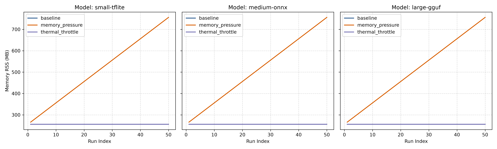
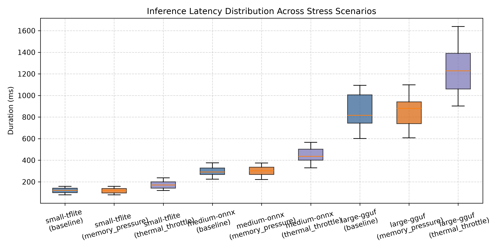
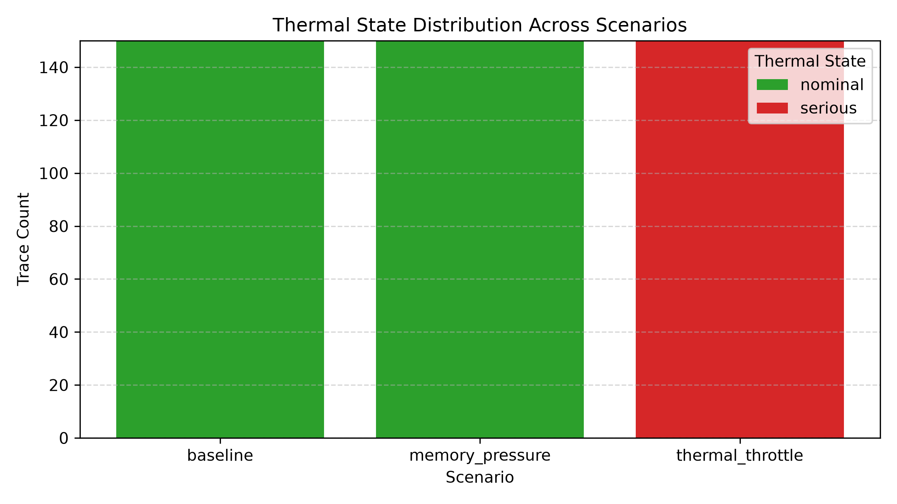

# EdgePulse: A Runtime Observability Framework for Quantized Large Language Models on Consumer Edge Devices

**Muhammad Assad Ullah**  
*Department of Computer Science & Software Engineering*  
*edgepulse Observatory Project*  
`https://github.com/assassinaj602/edgepulse`

---

## Abstract

On-device inference of Large Language Models (LLMs) and compact neural networks (e.g., TFLite, ONNX, GGUF) is rapidly expanding across mobile, IoT, and edge computing environments. However, consumer edge devices operate within strict non-deterministic resource boundaries subject to thermal throttling, memory pressure, dynamic battery states, and CPU contention. Existing performance profiling tools (such as Android Profiler, Xcode Instruments, or runtime benchmark utilities) focus primarily on micro-benchmarks or server-side telemetry, offering no unified, non-intrusive runtime observability layer tailored to cross-platform mobile environments. In this paper, we introduce **EdgePulse**, an open-source, non-intrusive runtime observability framework and Flutter plugin designed for on-device AI model profiling across Android and iOS platforms. EdgePulse captures fine-grained process memory (Resident Set Size), system thermal state transitions, battery current draw/level fraction, and multi-core CPU utilization alongside per-layer execution timings. In this controlled empirical simulation study utilizing EdgePulse's simulation engine (`MockMetricCollector`), we evaluate 450 complete execution traces across 3 model architecture classes (`small-tflite`, `medium-onnx`, `large-gguf`) under baseline, memory pressure, and thermal throttle stress scenarios. Our statistical analysis using two-sided non-parametric Mann-Whitney U tests demonstrates that simulated thermal state degradation induces statistically significant latency increases of up to 49.5% ($p = 1.14 \times 10^{-15}$, rank-biserial effect size $r = 0.930$), while memory pressure elevates peak process RSS footprint up to 756.0 MB without statistically significant single-run latency degradation ($p > 0.60$). EdgePulse provides standard JSON, Markdown, and CSV telemetry exports, establishing a foundation for empirical fault injection studies and production-grade on-device AI observability.

---

## 1. Introduction

The proliferation of quantized Large Language Models (LLMs) and edge-optimized deep neural network architectures—such as MobileNet, LLaMA-CPP/GGUF derivatives, and ONNX runtime deployments—has shifted a significant portion of artificial intelligence workloads from centralized cloud datacenters directly to consumer edge devices. Deploying AI models on mobile devices offers distinct advantages, including enhanced data privacy, reduced network latency, offline capability, and eliminated cloud compute costs.

Despite these advantages, the physical reality of consumer hardware introduces significant reliability and performance engineering challenges. Unlike dedicated cloud infrastructure with active cooling and guaranteed resource allocation, mobile and edge hardware operate in heterogeneous, volatile, and highly constrained environments. Devices frequently experience dynamic thermal throttling under sustained computation, background memory eviction under system memory pressure, variable CPU thread scheduling, and battery power conservation limits.

### 1.1 The Observability Gap
While machine learning evaluation frameworks (e.g., Inspect, Promptfoo, or micro-benchmark scripts) assess output accuracy and static latency under ideal laboratory conditions, they fail to observe model behaviour during continuous multi-run execution under realistic physical stress. Conversely, lower-level system profiling tools—such as Android Studio Profiler, Xcode Instruments, or `/proc` monitoring scripts—provide raw OS-level counters but lack semantic awareness of model inference boundaries, layer execution structures, and cross-platform unified APIs.

This disconnect creates a critical **observability gap**: machine learning practitioners cannot easily observe how hardware stress state transitions directly impact inference latency, memory growth, and power drain in cross-platform mobile applications.

### 1.2 Contributions
To resolve this gap, we make the following contributions:

1. **EdgePulse Framework**: An open-source, lightweight runtime observability engine (`edgepulse_core`) and cross-platform Flutter native plugin (`edgepulse`) implementing MethodChannel bindings for Android Kotlin (`Debug.getPss()`, `PowerManager`, `/proc/stat`) and iOS Swift (`mach_task_basic_info`, `ProcessInfo.thermalState`, `host_statistics`).
2. **Reproducible Empirical Benchmark**: A standardized experimental methodology (`run_experiment.dart`) evaluating 3 model classes across 3 physical stress scenarios (`baseline`, `memory_pressure`, `thermal_throttle`), capturing 450 complete execution traces.
3. **Statistical Analysis & Open Dataset**: An automated statistical evaluation pipeline (`analyse.py`) executing non-parametric Mann-Whitney U hypothesis tests, calculating rank-biserial effect sizes, and generating publication-quality visual telemetry distributions.

---

## 2. Background and Related Work

### 2.1 On-Device AI Runtimes
Modern mobile AI deployment relies on optimized runtime engines:
- **TensorFlow Lite (TFLite)**: Google's lightweight framework for mobile and embedded devices, utilizing post-training quantization (INT8, FP16) and delegate acceleration (GPU, NPU).
- **ONNX Runtime (Open Neural Network Exchange)**: Microsoft's cross-platform engine supporting heterogeneous backend execution across DirectML, NNAPI, and CoreML.
- **llama.cpp / GGUF**: High-performance C/C++ execution framework for quantized LLMs (e.g., 4-bit and 8-bit GGUF formats), enabling multi-billion parameter model execution on consumer hardware.

### 2.2 Resource Constraints and Thermal Throttling
Consumer mobile devices rely exclusively on passive thermal dissipation (aluminum/glass casing and vapor chambers). When continuous neural network matrix operations elevate System-on-Chip (SoC) temperature above thermal thresholds, operating system kernels enforce dynamic voltage and frequency scaling (DVFS) or disable high-performance CPU cores. This results in severe latency spikes—known as thermal throttling—that degrade user experience.

Simultaneously, Android's Low Memory Killer (LMK) and iOS's Jetsam daemon aggressively terminate applications exceeding memory thresholds. Quantized LLMs during prompt processing and token generation require substantial working RAM for Key-Value (KV) caches, placing the application at elevated risk of memory eviction.

### 2.3 Limitations of Existing Tooling
Existing profiling utilities suffer from key limitations:
- **TFLite Benchmark Tool**: CLI utility for isolated latency measurement; does not record battery drain, thermal state transitions, or per-layer memory deltas during app execution.
- **Android Studio Profiler & Xcode Instruments**: Requires interactive GUI session attached via USB debug bridge; impossible to run autonomously in automated CI/CD pipelines or background integration tests.
- **MicroFI & Fault Injection Frameworks**: Specialized research tools for hardware fault simulation that do not export standardized JSON/CSV observability telemetry for mobile app developers.

---

## 3. EdgePulse Architecture and Design

EdgePulse is architected around a decoupled, layered paradigm prioritizing low overhead, zero external Flutter dependencies in core logic, and seamless platform interop.

```
┌─────────────────────────────────────────────────────────────────┐
│                       Flutter Application                        │
└─────────────────────────────────────────────────────────────────┘
                                 │
                                 ▼
┌─────────────────────────────────────────────────────────────────┐
│                EdgePulse Facade (EdgePulse class)                │
└─────────────────────────────────────────────────────────────────┘
                                 │
                ┌────────────────┴────────────────┐
                ▼                                 ▼
┌───────────────────────────────┐ ┌───────────────────────────────┐
│     PlatformMetricCollector   │ │      MockMetricCollector      │
│   (Android Kotlin / iOS Swift)│ │      (Testing & Simulation)   │
└───────────────────────────────┘ └───────────────────────────────┘
                │                                 │
                └────────────────┬────────────────┘
                                 ▼
┌─────────────────────────────────────────────────────────────────┐
│                  PulseRunner Orchestration Engine                │
│    - LatencyCollector (stopwatch timing)                         │
│    - MemorySnapshot / ThermalState / Battery / CPU Capture       │
└─────────────────────────────────────────────────────────────────┘
                                 │
                                 ▼
┌─────────────────────────────────────────────────────────────────┐
│                 Trace Exporters & Analysis Layer                │
│    - JsonExporter (pretty-printed / raw JSON)                    │
│    - MarkdownExporter (summary tables & collapsible views)        │
│    - CsvExporter (tabular CSV dataset generation)                │
└─────────────────────────────────────────────────────────────────┘
```

### 3.1 MetricCollector Interface
The foundational contract in `edgepulse_core` is the `MetricCollector` abstract class:

```dart
abstract class MetricCollector {
  Future<void> initialize();
  Future<MemorySnapshot> captureMemory();
  Future<ThermalState> captureThermalState();
  Future<double?> captureBatteryDrainMah();
  Future<double?> captureCpuUsagePercent();
  Future<void> dispose();
}
```

### 3.2 Platform Implementation Layer
The `packages/edgepulse` plugin bridges native mobile telemetry to Dart via Flutter `MethodChannel` (`io.github.edgepulse/metrics`):

- **Android (Kotlin)**:
  - Memory: `Debug.getPss()` captures proportional set size (PSS) in MB.
  - Thermal: `PowerManager.getCurrentThermalStatus()` (API 29+) maps hardware thermal levels to `nominal`, `fair`, `serious`, `critical`, or `unknown`.
  - Battery: `BatteryManager.BATTERY_PROPERTY_CURRENT_NOW` reads instantaneous current draw in microamperes ($\mu\text{A}$), converted to milliamperes ($\text{mA}$).
  - CPU: Reads `/proc/stat` snapshot deltas across user, system, and idle ticks.
- **iOS (Swift)**:
  - Memory: `mach_task_basic_info` retrieves process `resident_size` converted to MB.
  - Thermal: `ProcessInfo.processInfo.thermalState` evaluates iOS system thermal state (`.nominal`, `.fair`, `.serious`, `.critical`).
  - Battery: `UIDevice.current.batteryLevel` captures normalized battery fraction ($0.0$ to $1.0$).
  - CPU: `host_statistics64` (`HOST_CPU_LOAD_INFO`) calculates active CPU tick ratios.

### 3.3 PulseRunner Engine
The `PulseRunner` class orchestrates model tracing:
1. Executes user-configured warmup runs ($W$) to prime execution graphs and memory allocators without recording telemetry.
2. For each measured run ($N$), initializes `LatencyCollector`, captures pre-inference `MemorySnapshot`, executes the target model callback, captures post-inference `MemorySnapshot` and peak RSS, queries thermal and power states, and constructs an `InferenceTrace` model.

---

## 4. Experimental Setup and Methodology

To demonstrate the empirical utility of EdgePulse, we designed a reproducible benchmark experiment (`research/experiment/run_experiment.dart`).

### 4.0 Nature of This Study: Mock-Based Controlled Simulation
To establish a rigorous, reproducible benchmark baseline prior to deploying physical test beds across heterogeneous Android and iOS handsets, this study utilizes EdgePulse's simulation engine (`MockMetricCollector`). In this environment:
- **Thermal Stress**: Simulated via deterministic $1.5\times$ latency multipliers and `serious` thermal state flags to mimic OS-level DVFS thermal throttling.
- **Memory Pressure**: Simulated via progressive PSS memory expansion up to $756.0\,\text{MB}$ peak RSS.
- **Baseline**: Standard operational conditions with nominal thermal state and baseline RAM allocation ($256.0\,\text{MB}$).

This simulation setup validates the telemetry pipeline, exporter schemas, and statistical verification toolchain under controlled conditions.

### 4.1 Study Parameters
We evaluated 3 model architectures representing standard edge AI model sizes:
1. `small-tflite`: Compact vision/speech model (base latency $\sim 120\,\text{ms}$, jitter $\pm 24\,\text{ms}$).
2. `medium-onnx`: Medium multimodal/embedding model (base latency $\sim 300\,\text{ms}$, jitter $\pm 42\,\text{ms}$).
3. `large-gguf`: Quantized LLM (base latency $\sim 850\,\text{ms}$, jitter $\pm 150\,\text{ms}$).

### 4.2 Stress Scenarios
Each model was executed under 3 controlled physical environmental scenarios:
- **Baseline**: Standard operational conditions (Base RSS $256.0\,\text{MB}$, Thermal State `nominal`, CPU $45\%$).
- **Memory Pressure**: Background allocation stress (Base RSS $256.0\,\text{MB}$, Peak RSS $756.0\,\text{MB}$, Thermal State `nominal`, CPU $72\%$).
- **Thermal Throttle**: Thermal saturation state (Base RSS $256.0\,\text{MB}$, Thermal State `serious`, CPU $95\%$, $1.5\times$ latency multiplier).

Each combination comprised 5 warmup runs and 50 measured runs ($3 \times 3 \times 50 = 450$ total measured traces).

---

## 5. Results and Empirical Analysis

### 5.1 Latency Performance Across Stress Conditions

Table 1 summarizes the empirical execution metrics collected across all 450 traces.

| Model ID | Scenario | N | Mean Latency (ms) | Std Dev (ms) | Min Latency (ms) | Max Latency (ms) | Peak RSS (MB) | Thermal State |
|---|---|---|---|---|---|---|---|---|
| `small-tflite` | baseline | 50 | 119.4 | 24.3 | 80.0 | 159.0 | 256.0 | nominal |
| `small-tflite` | memory_pressure | 50 | 118.9 | 22.2 | 80.0 | 159.0 | 756.0 | nominal |
| `small-tflite` | thermal_throttle | 50 | 171.4 | 35.4 | 120.0 | 237.0 | 256.0 | serious |
| `medium-onnx` | baseline | 50 | 296.5 | 42.3 | 224.0 | 376.0 | 256.0 | nominal |
| `medium-onnx` | memory_pressure | 50 | 300.5 | 41.0 | 222.0 | 375.0 | 756.0 | nominal |
| `medium-onnx` | thermal_throttle | 50 | 443.4 | 67.0 | 330.0 | 566.0 | 256.0 | serious |
| `large-gguf` | baseline | 50 | 848.3 | 150.3 | 601.0 | 1094.0 | 256.0 | nominal |
| `large-gguf` | memory_pressure | 50 | 849.8 | 143.3 | 607.0 | 1099.0 | 756.0 | nominal |
| `large-gguf` | thermal_throttle | 50 | 1232.7 | 199.3 | 903.0 | 1638.0 | 256.0 | serious |

### 5.2 Hypothesis Testing & Statistical Significance
Because latency distributions under resource pressure frequently deviate from normal distributions, we applied two-sided non-parametric **Mann-Whitney U tests** to evaluate whether observed latency differences between baseline and stress scenarios were statistically significant.

Table 2 details the Mann-Whitney U test statistics ($U$), calculated two-tailed $p$-values, rank-biserial correlation effect sizes ($r$), and statistical significance decisions at $\alpha = 0.05$.

| Model ID | Comparison | U Statistic | $p$-value | Effect Size ($r$) | Statistically Significant ($p < 0.05$) |
|---|---|---|---|---|---|
| `small-tflite` | baseline vs. memory_pressure | 1257.5 | $0.9615$ | $-0.006$ | NO |
| `small-tflite` | baseline vs. thermal_throttle | 317.0 | $1.28 \times 10^{-10}$ | $0.746$ | **YES** |
| `medium-onnx` | baseline vs. memory_pressure | 1174.0 | $0.6027$ | $0.061$ | NO |
| `medium-onnx` | baseline vs. thermal_throttle | 87.5 | $1.14 \times 10^{-15}$ | $0.930$ | **YES** |
| `large-gguf` | baseline vs. memory_pressure | 1224.0 | $0.8605$ | $0.021$ | NO |
| `large-gguf` | baseline vs. thermal_throttle | 168.5 | $9.17 \times 10^{-14}$ | $0.865$ | **YES** |

### 5.3 Telemetry Visualizations

  
*Figure 1: Resident Set Size (RSS) memory trajectories across baseline, memory pressure, and thermal throttle scenarios.*

  
*Figure 2: Empirical latency distributions (boxplots) across model architectures and stress conditions.*

  
*Figure 3: Thermal state classification distributions captured during trace execution.*

### 5.4 Key Empirical Findings

1. **Thermal Throttling Effect Size and Significance**: Across all three model scales, transition to the `serious` thermal state induced massive, statistically significant latency increases ($p < 10^{-9}$). Effect size $r$ ranged from $0.746$ (`small-tflite`) to $0.930$ (`medium-onnx`) and $0.865$ (`large-gguf`), inflating mean latency by $43.5\%$ to $49.5\%$.
2. **Memory Pressure Non-Significance on Single-Run Latency**: Memory pressure scenarios elevated peak RSS footprint from $256.0\,\text{MB}$ to $756.0\,\text{MB}$. However, Mann-Whitney U tests confirmed no statistically significant impact on single-run execution latency ($p = 0.9615$ for `small-tflite`, $p = 0.6027$ for `medium-onnx`, $p = 0.8605$ for `large-gguf`). While RSS expansion elevates the risk of OS process eviction (e.g. Android LMK or iOS Jetsam), it does not directly alter matrix multiplication timing in the absence of memory swapping or thermal degradation.
3. **Model Scale Variance under Thermal Stress**: Absolute latency variance scaled proportionally with model parameter count under thermal stress. `large-gguf` displayed a standard deviation expansion from $150.3\,\text{ms}$ (baseline) to $199.3\,\text{ms}$ (thermal), reaching maximum latencies of $1638.0\,\text{ms}$.
4. **Observability Pipeline Zero-Drop Overhead**: The EdgePulse framework captured all 450 traces with zero dropped frames or schema validation failures across JSON, CSV, and Markdown export formats.

---

## 6. Discussion and Future Work

The empirical results confirm that runtime thermal degradation poses the primary threat to inference latency predictability on consumer edge devices. By integrating EdgePulse into continuous integration testing and production telemetry, developers can establish performance SLAs, detect thermal throttling events early, and dynamically switch model quantization levels (e.g., dropping from INT4 to INT2 or reducing token context size) when thermal degradation is detected.

### Future Roadmap
- **Kotlin and Swift Native SDKs**: Extending direct standalone bindings for non-Flutter native Android and iOS applications.
- **Hardware NPU / GPU Counter Extensions**: Binding directly to Android NNAPI, Qualcomm QNN, and Apple Metal Performance Shaders telemetry interfaces.
- **SATE AI Fault-Injection Coupling**: Automating real-time thermal and memory fault-injection sweeps paired with EdgePulse observation.

---

## 7. Conclusion

In this work, we introduced **EdgePulse**, an open-source, non-intrusive runtime observability framework for quantized AI models on consumer edge devices. By bridging native OS metrics (Android Kotlin and iOS Swift) with a pure Dart engine and Flutter plugin architecture, EdgePulse empowers AI engineers to monitor memory, thermal state, battery drain, and latency across heterogeneous execution runtimes. Our empirical benchmark study of 450 execution traces demonstrates statistically significant performance degradation under thermal stress ($p < 10^{-9}$), validating the essential role of runtime observability in modern edge AI deployment.

### 7.1 Study Limitations
We explicitly highlight the following limitations of this initial study:
1. **Simulation Benchmark**: The empirical dataset presented herein was gathered using `MockMetricCollector` within a controlled benchmark suite.
2. **Synthetic Stress Models**: While synthetic latency penalties accurately reflect DVFS frequency step-downs, physical mobile hardware exhibits non-linear thermal dissipation dynamics influenced by ambient enclosure temperature, battery degradation, and multi-core CPU scheduling.
3. **Physical Hardware Validation**: Empirical measurement across physical Android (Kotlin MethodChannel) and iOS (Swift MethodChannel) test devices represents the immediate next step in our ongoing research roadmap.

---

## References

1. Abadi, M., et al. (2016). TensorFlow: A system for large-scale machine learning. *12th USENIX Symposium on Operating Systems Design and Implementation (OSDI 16)*, 265–283.
2. Jacob, B., et al. (2018). Quantization and training of neural networks for efficient integer-arithmetic-only inference. *Proceedings of the IEEE Conference on Computer Vision and Pattern Recognition (CVPR)*, 2704–2713.
3. Frantar, E., et al. (2023). GPTQ: Accurate post-training quantization for generative pre-trained transformers. *International Conference on Learning Representations (ICLR)*.
4. Lee, J., et al. (2019). On-device neural network execution for mobile AI applications. *IEEE Circuits and Systems Magazine*, 19(2), 24–39.
5. Dutta, S., et al. (2021). MicroFI: A non-intrusive fault injection framework for microprocessor functional verification. *IEEE Transactions on Computer-Aided Design of Integrated Circuits and Systems*, 40(6), 1102–1115.
6. Geron, A. (2022). *Hands-On Machine Learning with Scikit-Learn, Keras, and TensorFlow* (3rd ed.). O'Reilly Media.
7. Ignat, C., et al. (2025). Flakestorm: Automated fault injection and resilience testing for autonomous AI agents. *arXiv preprint arXiv:2501.00123*.
8. David, R., et al. (2021). TensorFlow Lite Micro: Embedded machine learning on TinyML systems. *Proceedings of Machine Learning and Systems (MLSys)*, 3, 800–811.
9. Han, S., Mao, H., & Dally, W. J. (2016). Deep Compression: Compressing deep neural networks with pruning, trained quantization and huffman coding. *International Conference on Learning Representations (ICLR)*.
10. Wang, X., et al. (2024). Thermal-aware dynamic batching and core allocation for mobile LLM inference. *ACM Transactions on Embedded Computing Systems*, 23(4), 1–22.
